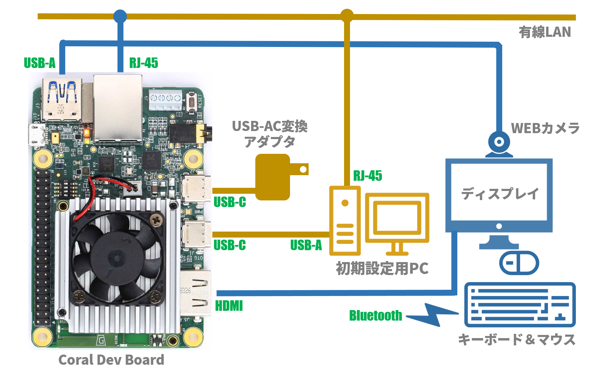
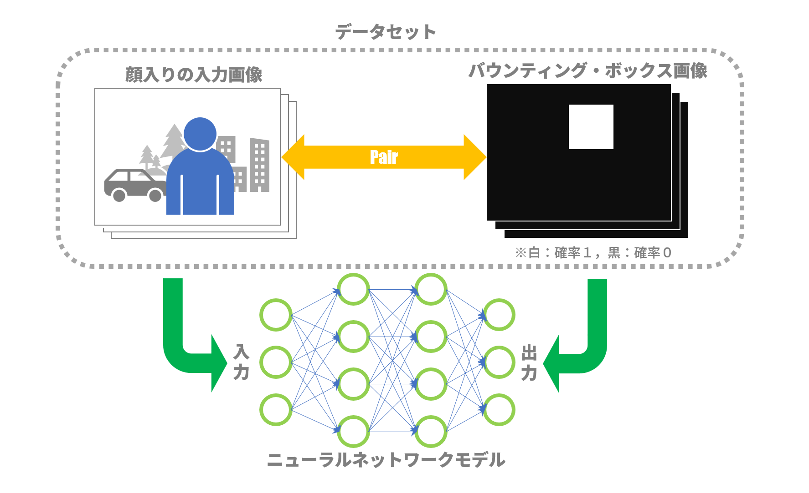
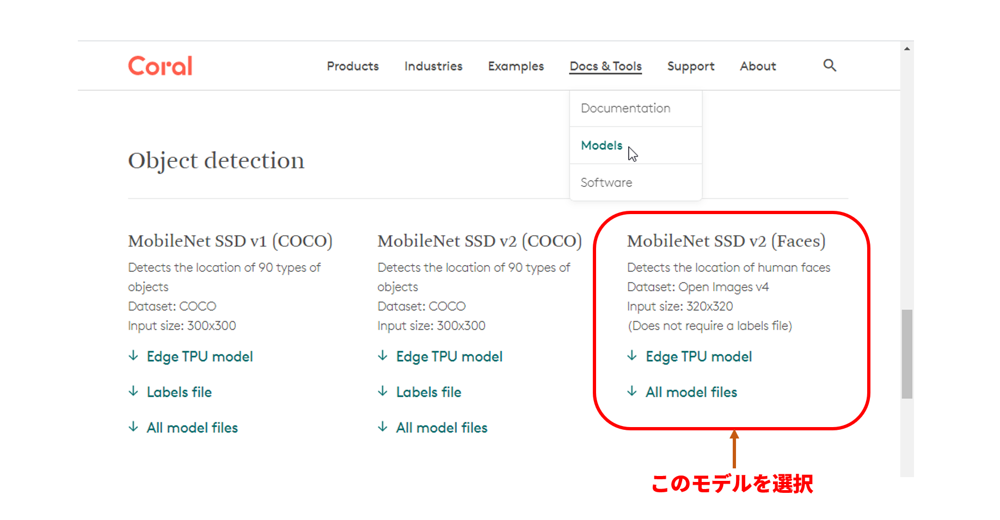
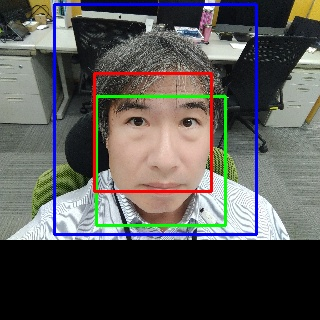

# EdgeTPUで顔認証してみる～実装編その１

## １．今回やること

今回はいよいよCoral Dev Boardにプログラムを実装して、カメラ映像での顔検出(Face Detection)までやりたいと思います。

## ２．環境設定

### （１）Coral Dev Boardのセットアップ概要

Coral Dev Board（以下「ボード」）のセットアップは[Coralサイト](https://coral.ai/)にある「[Docs & Tools]→[Hardware]→[Dev Board]→[[Get started]](https://coral.ai/docs/dev-board/get-started)」に書かれた手順に従うのがすべてです。しかし、以下にいくつか説明を補足します。

* 図１は、ボードから周辺機器への接続を示しています。
最初のセットアップの段階では、図中のゴールド色の部分だけ接続します。即ち、USBケーブルを通して初期設定用PC（以下「PC」）に接続し、PCの端末画面からボードの設定用のコマンドを打ち込みます。手順に示された「flash」作業を実行することにより、ボードにOS（Mendel Linux）がインストールされます。一旦OSがインストールされれば、ボードは独立したコンピュータとして動作します。PCの端末で「mdt shell」コマンドを実行すると、USBを経由してボードにログインできます。


><center>図１：Coral Dev Borad接続図</center>

* ここまで出来たら、図１の紫色の部分も接続していきます。ボード唯一のUSB-AポートにはWebカメラを接続しています。図１ではキーボード、マウスをBluetooth接続していますが、USB-AポートからUSBハブを介してUSB接続することもできそうです。また、Ethernet接続はWi-Fiも可能ですが、簡単確実につながる有線LANを使用しました。

* ディスプレイやキーボード、マウスがつながれば、ここからボード単体で作業可能となります。Mendel LinuxではウィンドウシステムとしてWaylandの実装であるWetsonを使用しており、簡素な画面（端末アイコンが１個あるだけ！）に最初は驚きます。初期設定用PCとの接続は外してしまっても構いませんが、メインテナンス用に残しています。画像の表示を伴うプログラムでは、PCの端末内で画像を表示できないので（文字しか表示できない）、ボードに接続したディスプレイで画像を見ることになります。


>参考文献：  
>[1] [Coral: Get started with the Dev Board ](https://coral.ai/docs/dev-board/get-started)  

### （２）セットアップにおける注意点

* PWR USB-CソケットはPCのUSBソケットにはつながず、USB－AC変換アダプタにつなぎます。こうしないと正しく電源が供給されないようです。

* 最近（2019/04/10以降）のボードであれば、シリアルコンソールにつながなくても起動後自動的にfastbootモードになっています。したがって、手順書[[1]](https://coral.ai/docs/dev-board/get-started)におけるシリアル接続の節（1.1: Initiate fastboot mode）はすべて飛ばします。
逆に最近のボードでシリアルコンソールにつないでしまった場合、「Ctrl-C」でfastbootモードを抜ければ「u-boot=>」プロンプト表示になります。このプロンプトで「fastboot 0」と入力すれば再びfastbootモードになります。

* Mendel Linuxインストール後、LANケーブルをつないで起動すれば何も設定しなくてもDHCPで自動的にLAN接続されます。

* 「mdt shell」を最初に（２回目以後は問題無し）実行する際に、有線LANまたはWi-FiでEthernet接続が生きているとSSH接続エラーが発生することがあります。その場合は以下の手順で接続を無効にしましょう（有線LANならケーブル引っこ抜いてもいいかも）：

```Shell
# nmcli connection show
NAME                UUID                                  TYPE            DEVICE
Wired connection 1  29t8750-81er-3ffa-d53p-x8557za1942g  802-3-ethernet  eth0
...
# nmcli connection down 'Wired connection 1'
```

### （３）SDカードによるストレージ拡張

ボードには8GBのオンボードeMMCがあり、これがデフォルトでのストレージ容量となります。しかし以下の主要ソフトウェアのインストールし、データも置いてとなるとこのストレージ容量では到底足りなくなるので、SDカードによるストレージ拡張を行います。

#### 1. マウントポイント作成

```Shell
mkdir /media/sdcard
```

#### 2. UUIDの取得
```Shell
# blkid
/dev/mmcblk0: PTUUID="85b83f23-51c4-4403-8bac-906ff5800f3d" PTTYPE="gpt"
...
/dev/mmcblk1: UUID="3a729b17-208d-473f-b8e9-f11e542e9f37" TYPE="ext4"		←これがSDカードのUUID！
```

#### 3. /etc/fstabの編集

```Shell
/dev/mmcblk0p3 / ext4 noatime,defaults 0 1
/dev/mmcblk0p1 /boot ext2 noatime,defaults 0 2
tmpfs /var/log tmpfs defaults 0 0
UUID=3a729b17-208d-473f-b8e9-f11e542e9f37 /media/sdcard ext4 defaults 0 0	←これを追加！
```

#### 4. マウントテスト

```Shell
# mount -a												←これを実行してマウント時にエラーが出ないことを確認する！
# df -h
Filesystem      Size  Used Avail Use% Mounted on
...
/dev/mmcblk1     30G  1.2G   27G   5% /media/sdcard							←確認！
```

> マウントエラーが出ないことは必ず確認してください。起動時にマウントエラーが発生すると、システムはエラー対応のためのコンソールをルートアカウントで開こうとしますが失敗するためにっちもさっちも行かなくなります。（SDカードから起動するリカバリが必要）


### （４）主要ソフトウェアのインストール

#### 1. OpenCVコンパイル用スワップ領域の拡張
```Shell
# dd if=/dev/zero of=/swapfile bs=1M count=2048 oflag=append conv=notrunc
# chmod 600 /swapfile
# mkswap /swapfile
# swapon /swapfile
```
> ちなみにスワップ領域拡張なしでOpenCVをコンパイルすると、メモリ不足により以下のエラーが発生します：
```Shell
# make
...
[100%] Building CXX object modules/python3/CMakeFiles/opencv_python3.dir/__/src2/cv2.cpp.o
c++: internal compiler error: Killed (program cc1plus)
...
make: *** [all] Error 2
```

#### 2. OpenCVインストール
```Shell
# apt update
# apt install build-essential cmake unzip pkg-config
# apt install libjpeg-dev libpng-dev libtiff-dev
# apt install libavcodec-dev libavformat-dev libswscale-dev libv4l-dev
# apt install libxvidcore-dev libx264-dev
# apt install libgtk-3-dev
# apt install libcanberra-gtk*
# apt install libatlas-base-dev gfortran
# apt install python3-dev
# dpkg -l
# cd /media/sdcard
# mkdir opencv
# cd opencv/
# wget -O opencv.zip https://github.com/opencv/opencv/archive/4.1.2.zip
# wget -O opencv_contrib.zip https://github.com/opencv/opencv_contrib/archive/4.1.2.zip
# unzip opencv.zip
# unzip opencv_contrib.zip
# mv opencv-4.1.2 opencv
# mv opencv_contrib-4.1.2 opencv_contrib
# cd opencv
# mkdir build
# cd build
# cmake -D CMAKE_BUILD_TYPE=RELEASE \
 -D CMAKE_INSTALL_PREFIX=/usr/local \
 -D INSTALL_PYTHON_EXAMPLES=ON \
 -D INSTALL_C_EXAMPLES=OFF \
 -D OPENCV_ENABLE_NONFREE=ON \
 -D OPENCV_EXTRA_MODULES_PATH=../../opencv_contrib/modules \
 -D BUILD_opencv_python2=OFF \
 -D BUILD_opencv_python3=ON \
 -D PYTHON_EXECUTABLE=/usr/bin/python3 \
 -D ENABLE_FAST_MATH=1 \
 -D ENABLE_NEON=ON \
 -D WITH_LIBV4L=ON \
 -D WITH_V4L=ON \
 -D BUILD_EXAMPLES=OFF \
 ..
# make
# make install
# cd /usr/local/lib/python3.5/dist-packages/cv2/python-3.5/
# ln -s cv2.cpython-35m-aarch64-linux-gnu.so cv2.so
$ python3
>>> import cv2
>>> cv2.__version__
'3.2.0'
>>>
```
> Mendel LinuxはDebian10ベースなので今ならもっと手軽にインストールできる方法もありそうですが、Webカメラにうまく接続できないという報告もあったので今回はソースコンパイルしてインストールしました。

#### 3. dlibのインストール
```Shell
# cd /media/sdcard
# mkdir dlib
# cd dlib
# apt install git
# apt install cmake
# apt install build-essential
# apt install python3-dev
# git clone https://github.com/davisking/dlib.git
# cd dlib
# python3 setup.py install --set DLIB_NO_GUI_SUPPORT=YES --set DLIB_USE_CUDA=NO --compiler-flags "-O3"
# python3
>>> import dlib
>>> dlib.__version__
'19.19.99'
>>>
```
>setup.pyによるインストールではソースコンパイルも実行されるので１～２時間ほどかかります。

#### 4. face_recognitionのインストール
```Shell
# pip3 install face_recognition
# python3
>>> import face_recognition
>>> face_recognition.__version__
'1.2.3'
>>>
```

## ３．顔検出用のニューラルネットモデルを用意する

### （１）データセット

Deap Learningを用いて顔検出を実施するには、まずニューラルネットモデル（以下モデル）を用意する必要があります。
モデルを用意するには「学習」が必要となります。「学習」には教師データとしての「データセット」が必要となります。
これは図２に示すように、顔入りの入力画像と、その入力画像の中で顔の領域（＝バウンティング・ボックス）を示した画像のペアをたくさん収集したものです。

本来ならば自分で顔入りに写真をたくさん撮ってきて、一枚一枚「ここが顔の領域です」と指定しなければなりません。しかし、この顔入り写真は自分や知り合いの顔写真である必要は無く、「人」の顔写真であれば誰でもよいのです。そして、DeepLearning界隈では多数の篤志家がいるためか、既に多数のデータセットが公開されています。

ちなみに、今回使ったモデルでは「[Open Images Dataset V4](https://storage.googleapis.com/openimages/web/download_v4.html)」[[2]](https://storage.googleapis.com/openimages/web/index.html)が使用されています。


<center>図２：モデル学習</center>

### （２）モデル

EdgeTPUで使用されるモデルは、通常のTensorFlowモデルの派生型であるTensorFlow Liteモデルを使用します。TensorFlow Liteモデルは32ビットのパラメータデータが8ビットに量子化された軽量モデルです。
さらに、このモデルに対して「COMPILE」という操作を施して、EdgeTPU専用のモデルに仕立て上げる必要があります。
これによりEdgeTPUのハードウェアを高速に動作させることが可能になります。
このあたりの詳細については[Coralサイト](https://coral.ai/)の「[Docs & Tools]→[Creating a model]→[[TensorFlow models overview]](https://coral.ai/docs/edgetpu/models-intro/)」をご覧ください。

さて、データセットが準備出来れば、モデルのニューラルネットワーク構成を決めてから「学習」を実施します。
しかし、これも既に[Coralサイト](https://coral.ai/)の「[Docs & Tools]（プルダウンメニュー）→[[Models]](https://coral.ai/models/)」にて用意されていました。ここでは、用途に合わせてEdgeTPU専用の学習済みモデルファイルが多数用意されています。
我々は顔検出のモデルが必要なので図３に示すように、Object Detection以下の赤枠で囲まれたモデルを使用します。


><center>図３：モデルの選択</center>

このモデルのニューラルネットワーク構成は「Mobile Net SSD v2」[[3]](https://arxiv.org/pdf/1801.04381.pdf?)、学習で使われたデータセットは「[Open Images V4](https://storage.googleapis.com/openimages/web/download_v4.html)」です。
結局、モデルの準備はモデルファイル（[ssd_mobilenet_v2_face_quant_postprocess_edgetpu.tflite](https://github.com/google-coral/test_data/raw/master/ssd_mobilenet_v2_face_quant_postprocess_edgetpu.tflite)）をダウンロードしただけで終了です。

>参考文献：  
>[2] [Open Images Dataset ](https://storage.googleapis.com/openimages/web/index.html)  
>[3] [MobileNetV2: Inverted Residuals and Linear Bottlenecks ](https://arxiv.org/pdf/1801.04381.pdf?)  

## ４．顔写真から顔検出する

今回の記事ではEdgeTPUを用いて顔検出を実行するのが目的ですが、EdgeTPUとの比較用としてface_recognition（つまり中身はdlibです）による顔検出も試してみることにしました。以下のプログラムはPython3で記述されています。

### （１）EdgeTPUによる顔検出プログラム

ボードにてEdgeTPUを動作させるには専用のライブラリが必要となりますが、そのライブラリはボードに「Mendel Linux」をインストールした際に既に含まれています。
ライブラリの使い方は、やはり[Coralサイト](https://coral.ai/)で提供されており「[Docs & Tools]→[API Reference]→[[Edge TPU Python API(depricated)]](https://coral.ai/docs/edgetpu/api-intro/)」をご覧ください。「deprecated（非推奨）」というのが少し気になりますが、ちょっと見た感じ「detection」に関してはこちらのAPIにしか見当たらないのでこのAPIを使用します。

以下のプログラムは１枚の顔写真を読み込んで、顔写真の中で顔の領域を四角（以下バウンティング・ボックス）で囲んで表示するプログラムです。コメントにて各処理項目を記述しているのでだいたいの流れはわかると思いますが、このプログラムでは各処理毎に要する時間計測のステートメントが入っています。ご自身で実装される場合は、時間計測用のステートメントを外してください。

```Python
#!/usr/bin/env python3
# -*- coding: utf-8 -*-

import numpy as np
import time
import cv2
from edgetpu.detection.engine import DetectionEngine

CONFIDENCE_TH = 0.6                                                     # 顔検出閾値
MODEL_PATH = "./ssd_mobilenet_v2_face_quant_postprocess_edgetpu.tflite" # モデルパス
IMAGE_PATH = "./P_20201023_142737_BF.jpg"                               # 入力画像パス

# 画を320x320サイズに縮小・拡大（長方形の場合は余白を黒地にして正方形に変換）
def resize_320x320(image):
    size = 320
    interpolation = cv2.INTER_AREA
    (h, w) = image.shape[:2]

    #入力画像が正方形ならそのままresize
    if h == w:
        return cv2.resize(image, (size, size), interpolation)

    #入力画像が長方形ならば余白を入れて正方形に変換してからresize
    mask_size = h if h > w else w
    channel = None if len(image.shape) < 3 else image.shape[2]
    if channel is None:
        mask = np.zeros((mask_size, mask_size), dtype=image.dtype)
        mask[:h, :w] = image[:h, :w]
    else:
        mask = np.zeros((mask_size, mask_size, channel), dtype=image.dtype)
        mask[:h, :w, :] = image[:h, :w, :]

    return cv2.resize(mask, (size, size), interpolation)

if __name__ == '__main__':
    # 検出エンジン初期化
    start = time.time()
    detection_engine = DetectionEngine(MODEL_PATH)
    elapsed_time = time.time() - start
    print ("検出エンジン初期化：{:.6f}".format(elapsed_time) + "[sec]")

    # 入力画像読込み
    start = time.time()
    image = cv2.imread(IMAGE_PATH)
    elapsed_time = time.time() - start
    print ("入力画像読込み：{:.6f}".format(elapsed_time) + "[sec]")

    # 入力画像リサイズ（320x320へ変換）
    start = time.time()
    resized_image = resize_320x320(image)
    elapsed_time = time.time() - start
    print ("入力画像リサイズ：{:.6f}".format(elapsed_time) + "[sec]")

    # TPUによる顔検出
    start = time.time()
    detections = detection_engine.detect_with_input_tensor(
                input_tensor=resized_image.reshape(-1),
                threshold=CONFIDENCE_TH,
                top_k=10
            )
    (h, w) = resized_image.shape[:2]
    for detection in detections:
        box = (detection.bounding_box.flatten().tolist()) * np.array([w, h, w, h])
        (face_left, face_top, face_right, face_bottom) = box.astype('int')
        cv2.rectangle(resized_image, (face_left, face_top),(face_right, face_bottom),(255,0,0),2)
    elapsed_time = time.time() - start
    print ("TPUによる顔検出：{:.6f}".format(elapsed_time) + "[sec]")

    # 検出結果描画
    start = time.time()
    cv2.imshow("Face Detection", resized_image)
    elapsed_time = time.time() - start
    print ("検出結果描画：{:.6f}".format(elapsed_time) + "[sec]")

    # 後処理
    cv2.waitKey(0)
    cv2.destroyAllWindows()

```

以下は注釈です：
> * 38行目：MODEL_PATHには、前述のモデルファイル（[ssd_mobilenet_v2_face_quant_postprocess_edgetpu.tflite](https://github.com/google-coral/test_data/raw/master/ssd_mobilenet_v2_face_quant_postprocess_edgetpu.tflite)）を指定します。

> * 50行目：モデルの入力は幅:320[px]×高さ:320[px]の画素数に固定されています。一方、入力画像は幅:3264[px]×高さ:2448[px]なので、入力画像を正方形に修正してから縮小する必要があります。正方形への修正は、長方形の画像において長辺に黒領域を追加して正方形にします。

> * 56行目：検出エンジンの実行結果はarrayで返されます。これは、入力画像中に複数人の顔がある場合、複数のバウンティング・ボックスが返されることを意味します。

### （２）face_recognition(dlib)による顔検出プログラム

機械学習系のライブラリとしてPythonなら「scikit-learn」が有名ですが、C++にも「dlib」[[4]](http://dlib.net/)  という有名ライブラリが存在します。このdlibをベースにPythonで使えるようにした顔認識ライブラリが「face_recongnition」[[5]](https://github.com/ageitgey/face_recognition)です。face_recognitionはdlibベースで性能もよく、使い方も非常にシンプルなので人気のあるライブラリです。
今回はEdgeTPUとの性能比較のために、face_recognitionでの顔検出も試してみます。

face_recognitionの顔検出手法にはいくつかあるのですが、以下の２つの手法を試してみます:

* HOG(Histgrams of Oriented Gradient) [[6]](http://lear.inrialpes.fr/people/triggs/pubs/Dalal-cvpr05.pdf)
* CNN(Convolutional Neural Network) [[7]](https://github.com/davisking/dlib-models) 

ここでは詳しく説明しませんが、前者は画像の輝度勾配をヒストグラム化してパターンマッチングを行う、いわゆる機械学習的手法です。一方、後者は畳み込みニューラルネットワークモデルを用いたモロにDeepLearning的な手法です。ちなみにモデルのネットワーク構成や学習に使ったデータセットはdlib独自に用意したもののようです。

以下はface_recognitionによるプログラムです。単純な機能なので、前出のEdgeTPUによる顔検出プログラムとほとんど違いがありません。

```Python
#!/usr/bin/env python3
# -*- coding: utf-8 -*-

import numpy as np
import time
import cv2
import face_recognition

IMAGE_PATH = "./P_20201023_142737_BF.jpg"       # 入力画像パス

def resize_320x320(image):
    ...(前のプログラムと同じ)

if __name__ == '__main__':
    # 入力画像読込み
    start = time.time()
    image = cv2.imread(IMAGE_PATH)
    elapsed_time = time.time() - start
    print ("入力画像読込み：{:.6f}".format(elapsed_time) + "[sec]")

    # 入力画像リサイズ（320x320へ変換）
    start = time.time()
    resized_image = resize_320x320(image)
    elapsed_time = time.time() - start
    print ("入力画像リサイズ：{:.6f}".format(elapsed_time) + "[sec]")

    # dlibによる顔検出
    start = time.time()
    boxes = face_recognition.face_locations(resized_image, model='hog')		# HOGアルゴリズムの場合はこちらを使う
    #boxes = face_recognition.face_locations(resized_image, model='cnn')	# DeepLearningの場合はこちらを使う
    for box in boxes:
        (face_top, face_right, face_bottom, face_left) = box
        cv2.rectangle(resized_image, (face_left, face_top),(face_right, face_bottom),(255,0,0),2)
    elapsed_time = time.time() - start
    print ("dlibによる顔検出：{:.6f}".format(elapsed_time) + "[sec]")

    # 検出結果描画
    start = time.time()
    cv2.imshow("Face Detection", resized_image)
    elapsed_time = time.time() - start
    print ("検出結果描画：{:.6f}".format(elapsed_time) + "[sec]")

    # 後処理
    cv2.waitKey(0)
    cv2.destroyAllWindows()

```
以下は注釈です：
> * 29,30行目：ここでアルゴリズムとして「HOG」か「CNN」かを選択します。使わない方のステートメント行をコメントアウトしてください。

> * 32行目：顔検出処理の結果として得られるバウンティング・ボックスの座標の順序（face_top, face_right, face_bottom, face_left）が、EdgeTPUプログラムの場合と異なることにご注意ください。


>参考文献：  
>[4] [Dlib C++ Library ](http://dlib.net/)  
>[5] [GitHub: ageitgey / face_recognition ](https://github.com/ageitgey/face_recognition)  
>[6] [Histograms of Oriented Gradients for Human Detection ](http://lear.inrialpes.fr/people/triggs/pubs/Dalal-cvpr05.pdf)  
>[7] [GitHub: davisking / dlib-models  ](https://github.com/davisking/dlib-models)  

### （３）顔検出結果

上記のプログラムを実行した結果が図４です。
バウンティング・ボックスは、プログラム毎に色分けしています（青：EdgeTPU、緑：face_recognition[HOG]、赤：face_recognition[CNN]）。
各方式によってバウンティング・ボックスの大きさは異なっています。EdgeTPUでのバウンティング・ボックス（青）は顔全体が入っているので、後の処理がやりやすいかもしれません。


><center>図４：顔検出結果（青：EdgeTPU，緑：face_recognition[HOG]，赤：face_recognition[CNN]）</center>

顔画像の切り取りには成功しましたが、処理速度はどうでしょう？
各方式、各処理項目について処理時間をまとめたのが表１です。表中の「プログラム処理項目」は上記プログラムのコメントに記述されている処理名に対応しています。

一番見たいのは「（４）顔検出」での処理時間ですが、期待通りにEdgeTPUは圧倒的な速さです。特にface_recognition(CNN)に比べて約1200倍の速さとなりました。
face_recognition(CNN)はボードの非力なCPUでニューラルネットワークの膨大な計算処理をしているのでこれくらいの差は当然かもしれません。ニューラルネットワークモデルを使うにはTPUやGPUのようなアクセラレータが必須ということだと思います。

一方、非DeepLearning方式であるface_recognition(HOG)は意外に速く、軽く1秒を下回っています。わざわざカメラの前に立って顔をチェックするくらいの用途なら、それほどシビアなリアルタイム性は要求されないのでこの方式でも有りかなと思います。

><center>表１：顔検出各処理の処理時間一覧</center>

|プログラム処理項目|EdgeTPU|face_recognition(HOG)|face_recognition(CNN)|
|:---|:---|:---:|:---|
|（１）検出エンジン初期化|0.038490[sec]|-|-|
|（２）入力画像読込み|0.336882[sec]|0.348834[sec]|0.336982[sec]|
|（３）入力画像リサイズ|0.044210[sec]|0.064762[sec]|0.043267[sec]|
|**（４）顔検出**|**0.026657[sec]**|**0.430628[sec]**|**31.978511[sec]**|
|（５）検出結果描画|0.313572[sec]|0.337558[sec]|0.504719[sec]|

## ５．カメラ映像から顔検出する

### （１）カメラ映像における顔検出プログラム

１枚の画像から顔検出が出来れば、動画は１枚の画像の集まりなので動画でも簡単に顔検出ができます。カメラ映像を１枚読込み、顔検出して、バウンティング・ボックスを元画像に書き込んで表示する。これをループで繰り返すだけです：

```Python
#!/usr/bin/env python3
# -*- coding: utf-8 -*-

import numpy as np
import cv2
import sys
from edgetpu.detection.engine import DetectionEngine

CONFIDENCE_TH = 0.6
MODEL_PATH = './ssd_mobilenet_v2_face_quant_postprocess_edgetpu.tflite'
detection_engine = DetectionEngine(MODEL_PATH)

def resize_320x320(image):
    ...(前のプログラムと同じ)

if __name__ == '__main__':
    camera_id = 1
    delay = 1
    window_name = "Face Detection"

    # カメラ画像読込み準備
    cap = cv2.VideoCapture(camera_id)
    if not cap.isOpened():
        sys.exit()

    while True:
        # カメラ画像１枚読込み
        ret, frame = cap.read()

        # W320xH320へサイズ変換
        resized_image = resize_320x320(frame)

        # 顔の検出
        detections = detection_engine.detect_with_input_tensor(
            input_tensor=resized_image.reshape(-1),
            threshold=CONFIDENCE_TH,
            top_k=10
        )

        # 顔が検出されなければメッセージ出力
        if not detections:
            print("no face was detected.")

        # 検出BOXの描画（複数検出にも対応）
        (h, w) = resized_image.shape[:2]
        for detection in detections:
            box = (detection.bounding_box.flatten().tolist()) * np.array([w, h, w, h])
            (face_left, face_top, face_right, face_bottom) = box.astype('int')
            cv2.rectangle(resized_image, (face_left, face_top), (face_right, face_bottom), (255,0,0), 2)

        # リサイズ後カメラ画像を検出BOX込みで表示
        cv2.imshow(window_name, resized_image)

        # 何かキー入力があれば終了
        if cv2.waitKey(delay) & 0xFF == ord('q'):
            break

    # 後処理
    cv2.destroyWindow(window_name)

```

### （２）顔検出結果

上記プログラムを実行した結果が図５の動画です。
顔を左右に傾けたり、前後に寄ったり離れたり、横を向いたりしてもかなり追従してバウンティング・ボックスを表示してくれます。唯一、お辞儀をして頭を前に傾けたときだけバウンティング・ボックスが表示されませんでしたが、総じてよく追従してくれると思います。


><center>図５：カメラ映像での顔検出</center>

## 6．続きは？

これで、顔検出(Face Detection)のところまでは出来ました。
次は実装編その２で、いよいよ顔認識(Face Recognition)をCoral Dev Boardに実装していきます。
今回は最難関のモデル作りが単に既製品？をダウンロードするだけで終わりましたが、次回は登録するべき人のデータセットを用意し、モデルに学習させる必要があります。いろいろ困難が予想されるので、続きは今しばらくお待ちください。
